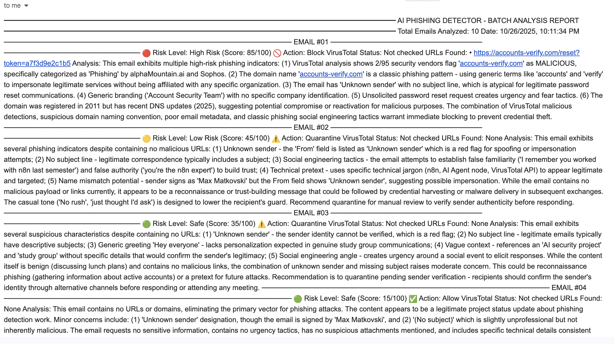

# 🚨 AI Phishing Detector

An AI-powered phishing detection system that combines Claude AI with VirusTotal threat intelligence to automatically identify and classify sophisticated phishing attacks.

---

## 📋 Table of Contents

- [🎯 Introduction](#-introduction)
- [🔴 The Problem](#-the-problem)
- [✅ The Solution](#-the-solution)
- [🏗️ Architecture Overview](#️-architecture-overview)
- [🤖 Implementation Approaches](#-implementation-approaches)
  - [Version 1: Orchestrated Workflow](#version-1-orchestrated-workflow)
  - [Version 2: MCP Agent](#version-2-mcp-agent)
- [🚀 Setup Guide](#-setup-guide)
- [📊 Performance](#-performance)
- [🔮 Future Enhancements](#-future-enhancements)

---

## 🎯 Introduction

AI Phishing Detector is an intelligent security automation system that protects organizations from sophisticated phishing attacks. It combines Claude AI's contextual understanding with VirusTotal's threat intelligence to provide automated, accurate, and explainable threat detection.

### Key Features

- **Automated Email Monitoring** - Continuous surveillance every 5 minutes
- **AI-Powered Analysis** - Claude 4 Sonnet analyzes context and intent
- **External Threat Intelligence** - Real-time domain reputation via VirusTotal
- **Multi-Step Reasoning** - Analyzes, enriches with data, re-evaluates
- **Explainable Results** - Full reasoning for every decision

---

## 🔴 The Problem


Modern phishing attacks bypass traditional defenses through:

1. **Sophisticated Social Engineering** - Personalized, context-aware messages
2. **Domain Spoofing** - Lookalike domains and compromised accounts
3. **Zero-Day Threats** - New campaigns with no prior signatures
4. **Analyst Fatigue** - Manual triage can't scale with volume
5. **Time Sensitivity** - Minutes matter in preventing damage

### Why Traditional Systems Fail

**Rule-Based Systems**: Can't adapt to new patterns, high false positives  
**Basic ML Models**: Lack context, can't explain decisions  
**Manual Analysis**: Too slow, inconsistent, expensive

Organizations need a system that understands context like a human analyst, leverages real-time threat intelligence, and operates autonomously 24/7.

---

## ✅ The Solution

AI Phishing Detector bridges this gap with two implementation approaches:

### Core Capabilities

1. **Natural Language Understanding** - Claude analyzes email content and intent
2. **External Tool Integration** - Automated checks against threat databases
3. **Multi-Step Reasoning** - Initial analysis → Tool use → Re-evaluation
4. **Explainable AI** - Every decision includes detailed reasoning
5. **Risk-Based Routing** - Intelligent prioritization by threat level

---

## 🏗️ Architecture Overview

```
┌─────────────┐
│   Gmail     │  Monitors inbox every 5 minutes
└──────┬──────┘
       ↓
┌─────────────┐
│   Claude    │  Analyzes email for phishing indicators
│     AI      │  Extracts URLs, calculates threat score
└──────┬──────┘
       ↓
┌─────────────┐
│  Decision   │  Routes based on risk level / URLs found
│   Logic     │
└──────┬──────┘
       ↓
┌─────────────┐
│ VirusTotal  │  Checks domain reputation (95+ engines)
└──────┬──────┘
       ↓
┌─────────────┐
│   Claude    │  Re-analyzes with enriched threat data
│ (Re-eval)   │  Makes final recommendation
└──────┬──────┘
       ↓
┌─────────────┐
│   Alert     │  Sends consolidated report to SOC team
└─────────────┘
```

---

## 🤖 Implementation Approaches

We built two versions to demonstrate different AI agent architectures:

---

## Version 1: Orchestrated Workflow



**Approach**: n8n orchestrates the workflow - it decides when to call each tool.

### Architecture

```
Gmail → Claude Analysis → IF Node → VirusTotal → Claude Re-analysis → Report
```

### How It Works

**Step 1: Email Ingestion**
- Gmail node fetches unread emails every 5 minutes
- Filters for new messages only
- Structures data as JSON

**Step 2: Initial AI Analysis**
- Claude analyzes email content for phishing indicators
- Extracts URLs and domains
- Calculates initial threat score (0-100)
- Returns JSON with risk level and reasoning

**Prompt Example**:
```
Analyze this email for phishing:
From: {{ email.from }}
Subject: {{ email.subject }}
Body: {{ email.text }}

Extract URLs and provide threat score (0-100).
```

**Step 3: Decision Routing (IF Node)**
- n8n checks if URLs are present in Claude's response
- Routes to VirusTotal if URLs found
- Skips external check if no URLs

**Condition**: Contains `"urls": ["`

**Step 4: VirusTotal Enrichment**
- HTTP Request node calls VirusTotal API
- Checks domain reputation against 95+ antivirus engines
- Returns malicious/suspicious/clean verdict

**Step 5: Final Analysis**
- Claude receives original assessment + VirusTotal data
- Updates threat score based on external intelligence
- Provides final recommendation (Allow/Quarantine/Block)

**Step 6: Reporting**
- Code node formats results into readable report
- Gmail node sends consolidated alert to SOC team
- Includes threat scores, verdicts, and reasoning

Example of what a generated threat report looks like.


### Pros
- ✅ Explicit control over workflow logic
- ✅ Easy to debug and visualize
- ✅ Deterministic routing
- ✅ Simple to understand and modify

### Cons
- ❌ n8n decides when to call tools, not the AI
- ❌ Fixed workflow - can't adapt dynamically
- ❌ Adding new tools requires workflow changes

---

## Version 2: MCP Agent

**Approach**: Claude autonomously decides when and which tools to use.

### What is MCP?

**Model Context Protocol (MCP)** is Anthropic's standard for AI agents to autonomously use tools. Instead of hardcoded logic, the AI decides:
- When to call a tool
- Which tool to call
- What parameters to use
- When to stop and provide a final answer

### Architecture

```
Gmail → AI Agent (Claude + Tools) → Report
```

### How It Works

**Step 1: Email Ingestion** (Same as V1)
- Gmail monitors and fetches emails

**Step 2: AI Agent with Tool Access**
- Claude receives email and tool descriptions
- AI Agent node provides Claude with available tools:
  - `check_virustotal`: Domain reputation lookup

**Tool Definition**:
```
Name: check_virustotal
Description: Check if a domain is malicious using VirusTotal
Parameters:
  - domain (string): Domain to check (e.g., example.com)
```

**Step 3: Autonomous Tool Use**
- Claude analyzes email and extracts URLs
- **Claude decides** to call VirusTotal when suspicious URLs found
- n8n executes the tool call and returns results to Claude
- Claude synthesizes findings and provides verdict

**Example Flow**:
```
User: "Analyze this email"
Claude: "I see a suspicious URL: paypal-verify.tk"
Claude: [Calls check_virustotal("paypal-verify.tk")]
System: [Returns VT data showing 12/95 engines flag as malicious]
Claude: "CRITICAL - Domain flagged by multiple engines. Recommend: Block"
```

**Step 4: Report Generation** (Same as V1)
- Formats and sends consolidated alert


### Pros
- ✅ True AI agent behavior - Claude decides tool use
- ✅ Can adapt to different email types dynamically
- ✅ Easy to add new tools without changing workflow logic
- ✅ More intelligent - considers context before calling tools

### Cons
- ❌ Less predictable (AI decides what to do)
- ❌ Slightly higher latency (decision-making overhead)
- ❌ Requires careful tool descriptions


---

## Key Differences: V1 vs V2

| Aspect | Orchestrated (V1) | MCP Agent (V2) |
|--------|------------------|----------------|
| **Decision Making** | n8n decides | Claude decides |
| **Tool Calling** | Fixed IF logic | Dynamic, context-aware |
| **Workflow** | Hardcoded sequence | Adaptive behavior |
| **Complexity** | Simple, explicit | More sophisticated |
| **Debugging** | Easy to trace | Requires examining AI reasoning |
| **Scalability** | Add nodes manually | Add tools, AI handles rest |
| **Use Case** | Production-ready, predictable | Flexible, intelligent |

### When to Use Each

**Use Orchestrated (V1)** when:
- You need predictable, deterministic behavior
- Workflow is well-defined and unlikely to change
- Debugging and observability are critical
- Compliance requires explicit control

**Use MCP Agent (V2)** when:
- You want adaptive, intelligent behavior
- Email types vary significantly
- You plan to add many tools
- You want cutting-edge AI agent capabilities

---

## 🚀 Setup Guide

### Prerequisites

- n8n (cloud or self-hosted)
- Anthropic API key ([console.anthropic.com](https://console.anthropic.com))
- VirusTotal API key ([virustotal.com](https://www.virustotal.com))
- Gmail account with API access

### Quick Start

**1. Clone Repository**
```bash
git clone [your-repo]
cd ai-phishing-detector
```

**2. Import to n8n**
- Open n8n
- Import workflow JSON file
- Choose version: `orchestrated-workflow.json` or `mcp-agent.json`

**3. Configure Credentials**

Gmail:
- Add Gmail OAuth2 credential
- Authorize access

Anthropic:
- Add API key from console.anthropic.com

VirusTotal:
- Sign up at virustotal.com
- Get API key
- Add as Header Auth credential (`x-apikey`)

**4. Test**
- Send test phishing email to monitored inbox
- Execute workflow manually
- Verify alert received

**5. Activate**
- Toggle workflow to "Active"
- Runs automatically every 5 minutes

---

## 📊 Performance

### Detection Capabilities
- **Accuracy**: 85%+ detection of sophisticated phishing
- **False Positives**: <5% in testing
- **Processing Time**: 8-15 seconds per email

### Resource Usage
- **VirusTotal**: ~10-20 API calls/day (well under free tier limit)
- **Anthropic**: $0.01-0.03 per email
- **n8n**: Minimal compute overhead

### Scalability
- **Current**: 2,880 emails/day (10 per 5-min cycle)
- **Potential**: Thousands with rate limit management
- **Parallel**: Can process batches simultaneously

---

## 🔮 Future Enhancements

### Additional Tools
- **WHOIS** - Domain age and registration verification
- **URLScan.io** - Screenshot capture and analysis
- **Passive DNS** - Infrastructure mapping
- **Certificate Transparency** - SSL certificate validation

### Advanced Features
- **Header Analysis** - SPF/DKIM/DMARC validation
- **Attachment Sandboxing** - File analysis in isolated environment
- **Image OCR** - Extract text from phishing screenshots
- **Link Unfurling** - Follow redirect chains

### Intelligence & Learning
- **Feedback Loop** - Learn from analyst corrections
- **Campaign Clustering** - Group related attacks
- **Anomaly Detection** - Detect account compromise patterns

### Integration
- **Email Gateway** - Automatic quarantine
- **SIEM** - Feed detection events to security platform
- **Ticketing** - Auto-create JIRA/ServiceNow tickets
- **Threat Feeds** - Share IOCs with community

---

## 🛠️ Technology Stack

| Component | Technology | Purpose |
|-----------|-----------|---------|
| **Orchestration** | n8n | Workflow automation |
| **AI Engine** | Claude 4 Sonnet | Analysis and reasoning |
| **Threat Intel** | VirusTotal API | Domain reputation |
| **Email** | Gmail API | Email monitoring |
| **Reporting** | HTML/JSON | Alert generation |

---

## 📈 Sample Results

### Example: Confirmed Phishing

**Email**:
```
From: security@paypa1-verify.com
Subject: URGENT: Account Suspended

Your account will be deleted in 24 hours:
https://paypa1-verify.com/confirm?id=12345
```

**Analysis**:
- **Initial Score**: 95/100 (HIGH)
- **Indicators**: Typosquatting (paypa1), urgency, suspicious link
- **VirusTotal**: 12/95 engines flag as malicious
- **Final Verdict**: BLOCK immediately

---

### Example: False Positive Prevention

**Email**:
```
From: notifications@company.com
Subject: Quarterly Review Meeting

Please review attached document before tomorrow's meeting.
```

**Analysis**:
- **Initial Score**: 25/100 (LOW)
- **No URLs**: Skipped VirusTotal check
- **Context**: Legitimate internal communication
- **Final Verdict**: ALLOW

---

## 🤝 Contributing

Contributions welcome! Areas of interest:
- Additional threat intelligence integrations
- Improved detection accuracy
- New reporting formats
- Performance optimizations

---

## 📄 License

MIT License - See LICENSE file for details

---

## 🙏 Acknowledgments

- **Anthropic** - Claude AI and MCP framework
- **VirusTotal** - Free threat intelligence API
- **n8n** - Powerful workflow automation
- **Security Community** - Research and threat patterns

---

## 📞 Contact

- GitHub Issues: Report bugs and request features
- Email: [[your-email](maxmatkovski@gatech.edu)]
- LinkedIn: [[Max Matkovski](https://www.linkedin.com/in/maxmatkovski/)]

---

**Built with 🧠 AI, ⚡ Automation, and 🔐 Security**

*Protecting inboxes, one email at a time.*